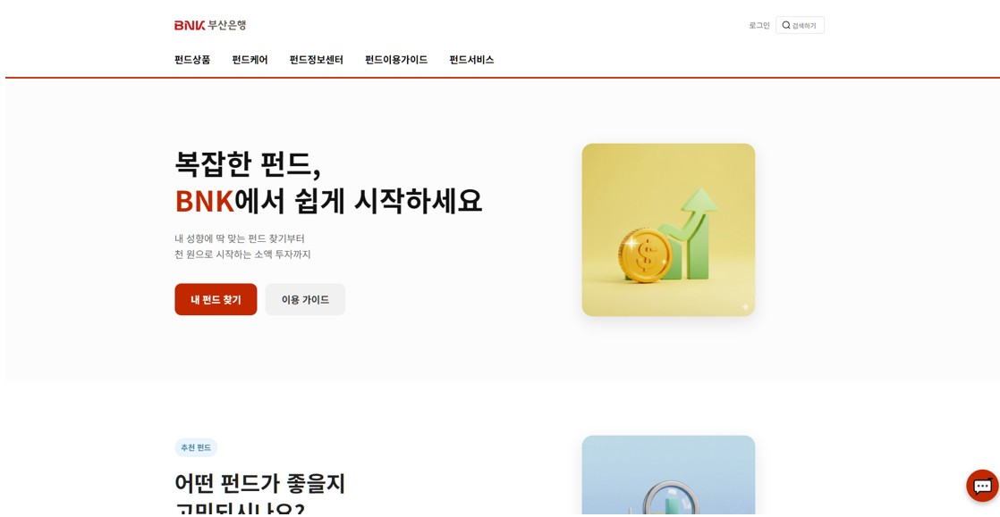
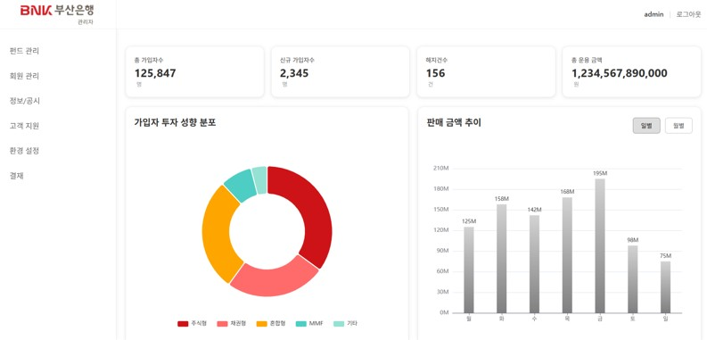
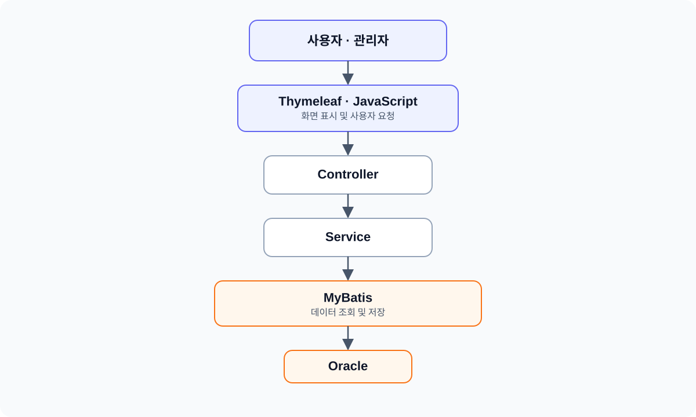
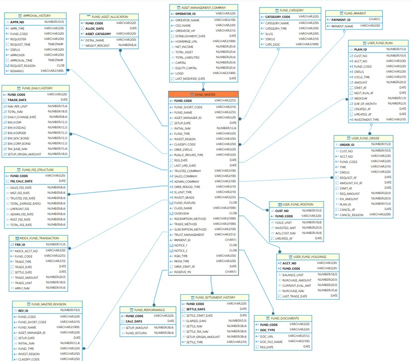
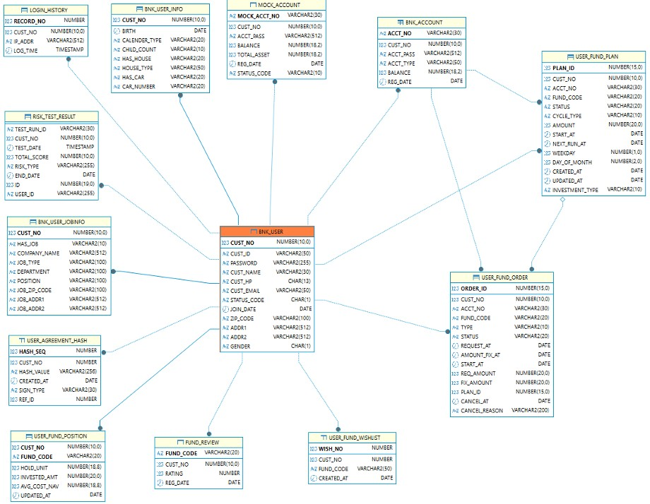
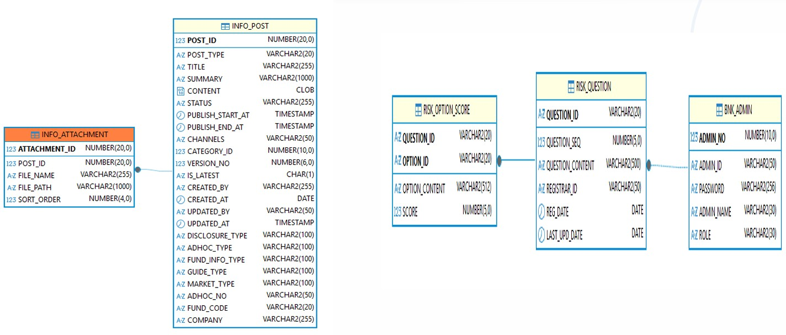
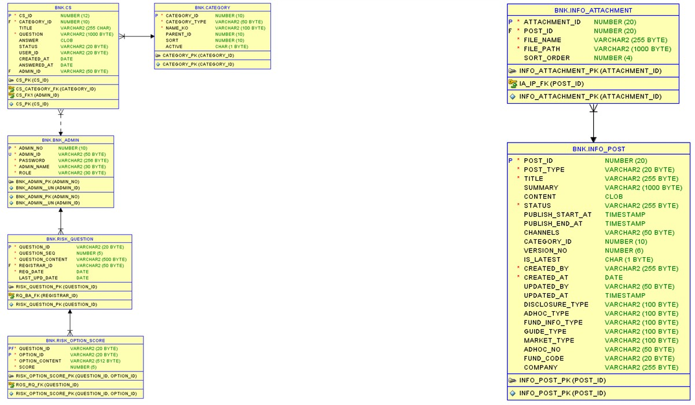
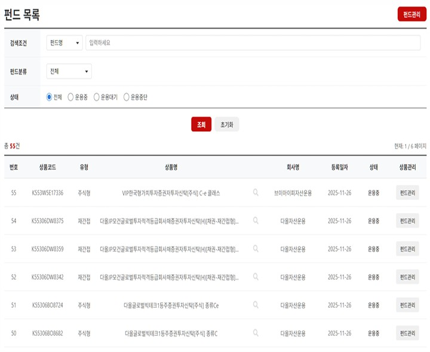
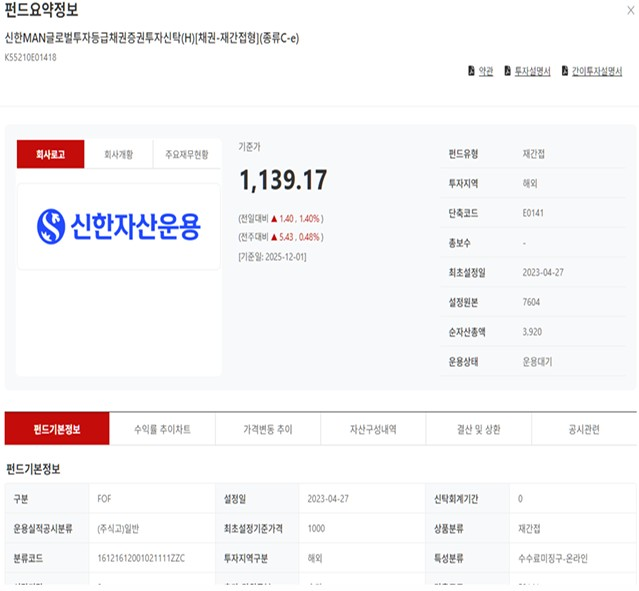
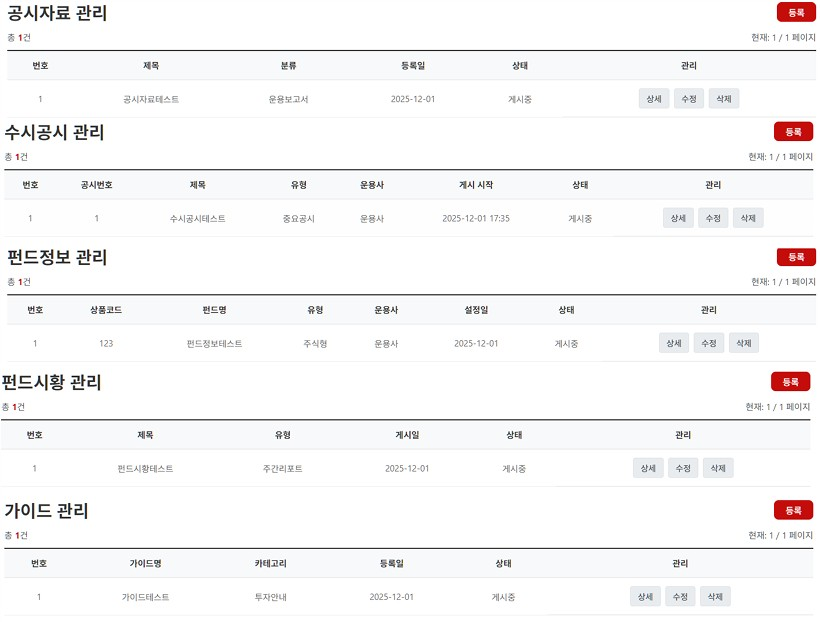

# 🏦 BNK 금융상품 통합 관리 서비스

BNK 부산은행 금융 DT 아카데미 개발자 양성과정에서 진행한 팀 프로젝트입니다.

고객용 금융상품 서비스와 관리자 시스템을 함께 구현한 금융 웹 애플리케이션입니다.

---

## 📌 프로젝트 개요

BNK 금융상품 통합 관리 서비스는 고객이 펀드 상품을 조회하고 투자 성향을 분석할 수 있는 사용자 기능과 상품·회원·가입 내역·정보공시 등을 관리하는 관리자 기능을 구현한 프로젝트입니다.

| 구분 | 내용 |
| --- | --- |
| 프로젝트 형태 | 팀 프로젝트 |
| 개발 기간 | 2025.11 ~ 2025.12 |
| 팀 구성 | 5명 |
| 사용자 사이트 | 회원, 금융상품, 투자 성향 분석, 고객센터, AI 챗봇 |
| 관리자 사이트 | 회원관리, 상품가입, 상품관리, 결재, 검색어, 카테고리, 정보공시 |

---

## 👥 팀 구성

* 팀장: 정순권
* 팀원: 박민규, 설유진, **이종봉**, 최상규

---

## 🖥️ 주요 화면

### 사용자 메인페이지

BNK 금융상품 통합 관리 서비스의 사용자 메인 화면입니다.

펀드 상품을 조회하고 투자 성향 분석, 고객센터, AI 챗봇 등의 기능으로 이동할 수 있습니다.



### 관리자 메인페이지

BNK 금융상품 통합 관리 서비스의 관리자 메인 화면입니다.

회원, 상품, 가입 내역, 정보공시 등 금융 서비스 운영 정보를 확인하고 각 관리 기능으로 이동할 수 있습니다.



---

## ⚙️ 기술 스택

| 구분 | 기술 |
| --- | --- |
| Frontend | HTML5, CSS3, JavaScript, Thymeleaf |
| Backend | Java 17, Spring Boot, Spring MVC |
| Security | Spring Security |
| Data | MyBatis |
| Database | Oracle |
| Chart | Chart.js |
| API·기타 | REST API, JSON, 데이터 스크래핑 |
| Tools | IntelliJ IDEA, DBeaver |
| Collaboration | GitHub, Figma, Slack |

---

## 🏛️ 시스템 아키텍처



---

## 🏗️ 주요 기능

### 사용자 사이트

* 메인: 금융상품 및 주요 서비스 안내
* 회원: 로그인, 회원가입
* 금융상품: 펀드 상품 목록 및 상세 조회
* 투자 성향 분석: 설문을 통한 투자 성향 분석
* 정보공시: 정보공시, 수시공시, 펀드시황 조회
* 금융정보: 가이드, 펀드정보 조회
* 고객센터: 공지사항, FAQ
* AI 챗봇: 금융상품 및 서비스 관련 질의응답

### 관리자 사이트

* 메인: 관리자 대시보드
* 환경설정: 검색어, 카테고리 관리
* 회원관리: 회원 목록 및 회원정보 조회
* 상품관리: 펀드 상품 목록, 상세 조회, 등록 및 수정
* 가입관리: 고객의 금융상품 가입 내역 및 결재 처리
* 정보공시: 정보공시, 수시공시 관리

---

## 🗃️ ERD

회원, 펀드 상품, 상품 가입, 투자 성향, 정보공시 등 금융 서비스의 주요 데이터를 기준으로 테이블 관계를 설계했습니다.

회원정보를 기준으로 상품 가입과 투자 성향 분석 결과가 연결되며, 펀드 상품정보를 기준으로 수익률·기준가·순자산가치·상품 문서 등의 상세 정보가 연결되도록 구성했습니다.









---

# 👨‍💻 담당 역할 — 관리자 상품 및 정보공시 관리

프로젝트에서 **관리자 상품 목록·상품 상세 조회·정보공시 게시판**을 담당했습니다.

관리자 상품 목록에서 검색과 페이지네이션을 이용해 상품을 조회하고, 선택한 상품의 상세 정보를 페이지 이동 없이 모달로 확인할 수 있도록 구현했습니다.

또한 정보공시, 수시공시, 펀드시황, 가이드, 펀드정보 게시판의 게시물 관리와 첨부파일 기능을 구현했습니다.

## 담당 기능

* 관리자 펀드 상품 목록 조회
* 상품 검색 및 페이지네이션
* 펀드코드 기반 상품 상세 조회
* 상품 상세 모달 비동기 데이터 연동
* 상품 기준가·수익률·순자산가치 출력
* Chart.js를 이용한 상품 차트 출력
* 약관·투자설명서·간이투자설명서 PDF 연결
* 정보공시·수시공시·펀드시황·가이드·펀드정보 게시물 CRUD

---

## 1. 관리자 상품 목록

Oracle 데이터베이스에 등록된 펀드 상품을 관리자 화면에서 조회할 수 있도록 구현했습니다.

상품명, 상품코드 및 상품 유형을 기준으로 검색할 수 있으며, 검색 결과가 많을 경우 페이지를 나누어 확인할 수 있도록 페이지네이션을 적용했습니다.

```text
관리자 상품 관리 접속
        ↓
검색 조건 및 페이지 전달
        ↓
Controller 요청 처리
        ↓
Service·MyBatis Mapper 조회
        ↓
Oracle 상품 데이터 조회
        ↓
상품 목록 출력
```

### 관리자 상품 목록 화면



---

## 2. 관리자 상품 상세 조회

관리자 상품 목록에서 돋보기 버튼을 선택하면 해당 상품의 펀드코드를 기준으로 상세 데이터를 조회하도록 구현했습니다.

JavaScript에서 서버로 비동기 요청을 보내고, 반환된 JSON 데이터를 상품 상세 모달에 출력하도록 구성했습니다.

```text
상품 목록에서 돋보기 선택
        ↓
선택한 상품의 펀드코드 전달
        ↓
JavaScript 비동기 요청
        ↓
상품 상세 데이터 조회
        ↓
JSON 데이터 반환
        ↓
상품 상세 모달 출력
```

상품 상세 모달에서는 다음 정보를 확인할 수 있습니다.

* 펀드명 및 펀드코드
* 상품 유형과 분류 정보
* 기준가와 기준일
* 전일·전주 대비 정보
* 기간별 수익률
* 순자산가치
* 투자지역 및 위험등급
* 설정액과 신탁기간
* 운용사·수탁사·판매사 정보
* 보수 및 수수료
* 상품 수익률 차트

### 관리자 상품 상세 화면



---

## 3. 정보공시 게시판

관리자가 금융 관련 공시와 안내 게시물을 관리할 수 있도록 게시판 기능을 구현했습니다.

* 정보공시
* 수시공시
* 펀드시황
* 가이드
* 펀드정보

게시판별 게시물 등록·조회·수정·삭제와 검색, 페이지네이션 및 첨부파일 기능을 구현했습니다.

```text
게시판 선택
        ↓
게시물 목록 조회
        ↓
게시물 등록·조회·수정·삭제
        ↓
Oracle 데이터 반영
        ↓
처리 결과 출력
```

### 정보공시 관리 화면



---

## 🔧 트러블슈팅

### 1. MyBatis XML 비교 연산자 파싱 오류

#### 문제

펀드 상세 화면에서 전일·전주 기준가를 조회하기 위해 날짜 조건이 포함된 SQL을 작성하는 과정에서 MyBatis Mapper XML 파싱 오류가 발생했습니다.

이로 인해 Mapper가 정상적으로 등록되지 않아 상품 상세 데이터를 조회할 수 없었습니다.

#### 원인

SQL에 작성한 `<`, `<=` 연산자를 XML 파서가 날짜 비교 조건이 아닌 새로운 XML 태그의 시작으로 인식하고 있었습니다.

MyBatis Mapper는 SQL을 XML 내부에 작성하기 때문에 `<`와 같은 XML 특수문자를 그대로 작성하면 문서 구조가 올바르게 해석되지 않습니다.

#### 해결

날짜 비교 조건이 포함된 SQL을 `CDATA`로 감싸 XML 파서가 해당 부분을 일반 문자열로 처리하도록 수정했습니다.

```xml
<![CDATA[
    AND trade_date <= fdh.trade_date - 7
]]>
```

수정 후 전일·전주 기준가와 대비 데이터를 정상적으로 조회할 수 있었습니다.

---

### 2. 펀드 문서 파일명 불일치

#### 문제

상품 상세 화면에서 약관·투자설명서·간이투자설명서 PDF를 선택했을 때 `404 Not Found` 오류가 발생했습니다.

문서 3종은 서버의 정상 경로에 저장되어 있었지만, 상품 상세 화면에서 해당 파일을 불러올 수 없었습니다.

#### 원인

JavaScript에서 요청한 PDF 파일명과 서버에 저장된 실제 파일명이 서로 달랐습니다.

화면에서는 영문 문서명을 기준으로 URL을 생성했지만, 서버에는 한글 문서명으로 파일이 저장되어 있어 요청한 파일을 찾지 못했습니다.

```text
요청 파일명
펀드코드_terms.pdf
펀드코드_invest.pdf
펀드코드_summary.pdf

서버의 실제 파일명
펀드코드_약관.pdf
펀드코드_투자설명서.pdf
펀드코드_간이투자설명서.pdf
```

#### 해결

JavaScript에서 생성하는 문서 요청 URL의 파일명을 서버의 실제 파일명 규칙과 동일하게 수정했습니다.

```text
펀드코드_terms.pdf
→ 펀드코드_약관.pdf

펀드코드_invest.pdf
→ 펀드코드_투자설명서.pdf

펀드코드_summary.pdf
→ 펀드코드_간이투자설명서.pdf
```

수정 후 약관·투자설명서·간이투자설명서 버튼에서 서버에 저장된 PDF 문서 3종을 정상적으로 불러올 수 있었습니다.

---

### 3. MyBatis Mapper namespace 불일치

#### 문제

관리자 정보공시 기능에서 Mapper 인터페이스에 작성한 메서드와 Mapper XML의 SQL이 정상적으로 연결되지 않는 문제가 발생했습니다.

이로 인해 정보공시 게시물과 첨부파일을 등록하거나 조회하는 과정에서 해당 SQL을 찾을 수 없었습니다.

#### 원인

Mapper 인터페이스의 패키지 경로를 `mapper.admin`으로 변경했지만 Mapper XML의 `namespace`에는 기존 패키지 경로가 남아 있었습니다.

MyBatis는 Mapper 인터페이스의 전체 경로와 XML의 `namespace`를 기준으로 메서드와 SQL을 연결하기 때문에 두 경로가 다르면 매핑되지 않습니다.

#### 해결

Java Mapper의 전체 패키지 경로와 Mapper XML의 `namespace`를 동일하게 수정했습니다.

```xml
<mapper namespace="kr.co.bnk.bnk_project.mapper.admin.InfoPostMapper">
```

또한 게시물과 첨부파일 처리를 `InfoPostMapper`와 `InfoAttachmentMapper`로 분리하여 관리하도록 구성했습니다.

수정 후 정보공시 게시물과 첨부파일 관련 SQL이 정상적으로 연결되는 것을 확인했습니다.

---

## 💡 구현 결과 및 회고

관리자 상품 목록 조회부터 상품 선택, 상세 데이터 요청, Oracle 조회, JSON 응답, 모달 출력까지 이어지는 상품 상세 조회의 전체 흐름을 구현했습니다.

화면에 작성되어 있던 예시 데이터를 실제 Oracle 데이터로 변경하면서 화면, JavaScript, Controller, Service, Mapper와 데이터베이스가 연결되는 과정을 경험했습니다.

또한 여러 유형의 정보공시 게시물을 관리하는 기능을 구현하면서 게시물과 첨부파일이 화면·서버·데이터베이스에서 처리되는 흐름을 이해할 수 있었습니다.

이번 프로젝트를 통해 개별 기능의 구현뿐만 아니라 관리자가 상품을 검색하고 상세 정보를 확인하며 금융 관련 게시물을 관리하는 전체 업무 흐름을 고려해 개발하는 경험을 쌓았습니다.

---

## 📂 디렉터리 구조

```text
/templates
 ├── index.html                              # 사용자 메인페이지
 ├── index_origin.html                       # 기존 사용자 메인페이지
 ├── sidebar.html                            # 사용자 공통 사이드바
 ├── searchResult.html                       # 통합검색 결과
 ├── chatbot.html                            # AI 챗봇
 ├── FAQ.html                                # FAQ
 │
 ├── productList.html                        # 펀드 상품목록
 ├── productDetail.html                      # 펀드 상품상세
 ├── gaip.html                               # 펀드 상품가입
 │
 ├── investTest.html                         # 투자성향 분석
 ├── investorInfo.html                       # 투자자 정보
 │
 ├── fundInformation.html                    # 펀드정보
 ├── fundSihwang.html                        # 펀드시황
 ├── fundSusi.html                           # 수시공시
 ├── fundGuide.html                          # 펀드 가이드
 └── dopisitGuide.html                       # 예금 가이드

/member                                      # 회원
 ├── _head.html                              # 회원 화면 공통 헤더
 ├── _tail.html                              # 회원 화면 공통 푸터
 ├── login.html                              # 로그인
 ├── registerType.html                       # 회원가입 유형 선택
 ├── terms.html                              # 회원가입 약관 동의
 ├── register.html                           # 회원정보 입력
 ├── survey.html                             # 투자성향 설문
 ├── survey_result.html                      # 투자성향 분석 결과
 └── complete.html                           # 회원가입 완료

/my                                          # 마이페이지
 ├── _head.html                              # 마이페이지 공통 헤더
 ├── _tail.html                              # 마이페이지 공통 푸터
 ├── sidebar.html                            # 마이페이지 사이드바
 ├── dashboard.html                          # 마이페이지 대시보드
 ├── info.html                               # 회원정보
 ├── additionalInvestmentHistory.html        # 추가 투자 내역
 ├── additionalInvestmentReservation.html    # 추가 투자 예약
 ├── newFundReservationCancel.html           # 신규 펀드 예약 취소
 ├── lateNewFundReservationCancel.html       # 신규 펀드 예약 취소 내역
 │
 ├── check/                                  # 펀드 조회
 │    ├── basicPriceInquiry.html              # 기준가격 조회
 │    ├── fundAccountInquiry.html             # 펀드계좌 조회
 │    ├── yieldInquiry.html                   # 수익률 조회
 │    └── reportChange.html                   # 변경 내역 조회
 │
 └── qna/                                    # 문의내역
      ├── list.html                           # 문의 목록
      └── write.html                          # 문의 작성

/admin                                       # 관리자 시스템
 ├── _header.html                            # 관리자 공통 헤더
 ├── _sidebar.html                           # 관리자 공통 사이드바
 ├── login.html                              # 관리자 로그인
 ├── adminMain.html                          # 관리자 메인페이지
 │
 ├── member/                                 # 회원관리
 │    ├── list.html                           # 회원 목록
 │    ├── list-detail.html                    # 회원 목록 상세
 │    ├── detail.html                         # 회원 상세정보
 │    └── permission.html                     # 회원 권한 관리
 │
 ├── product/                                # 상품관리
 │    ├── adminproduct.html                   # 펀드 상품목록 및 상세
 │    ├── adminproduct-register.html          # 펀드 상품등록
 │    ├── adminproduct-edit.html              # 펀드 상품수정
 │    ├── adminproduct-pending.html           # 상품 승인 대기
 │    ├── adminproduct-status.html            # 상품 판매 상태
 │    └── adminproduct-documents.html         # 상품 문서 관리
 │
 ├── approval_management/                    # 결재관리
 │    ├── approval_management.html            # 결재 요청 관리
 │    └── approval_history.html               # 결재 처리 내역
 │
 ├── info&disclosures/                       # 정보공시 및 금융정보
 │    ├── disclosures_documents.html          # 정보공시
 │    ├── ad-hoc_disclosure.html              # 수시공시
 │    ├── fund_market.html                    # 펀드시황
 │    ├── guide.html                          # 금융 가이드
 │    └── fund_info.html                      # 펀드정보
 │
 ├── cs/                                     # 고객센터 관리
 │    ├── faq.html                            # FAQ 목록
 │    ├── faq-register.html                   # FAQ 등록
 │    ├── faq-edit.html                       # FAQ 수정
 │    ├── qna.html                            # Q&A 목록
 │    ├── qna-detail.html                     # Q&A 상세
 │    └── qna-edit.html                       # Q&A 수정
 │
 └── settings/                               # 환경설정
      ├── category_management.html            # 카테고리 관리
      ├── search_keyword.html                 # 검색어 관리
      ├── terms_management.html               # 약관 관리
      └── logViewer.html                      # 로그 조회

```
